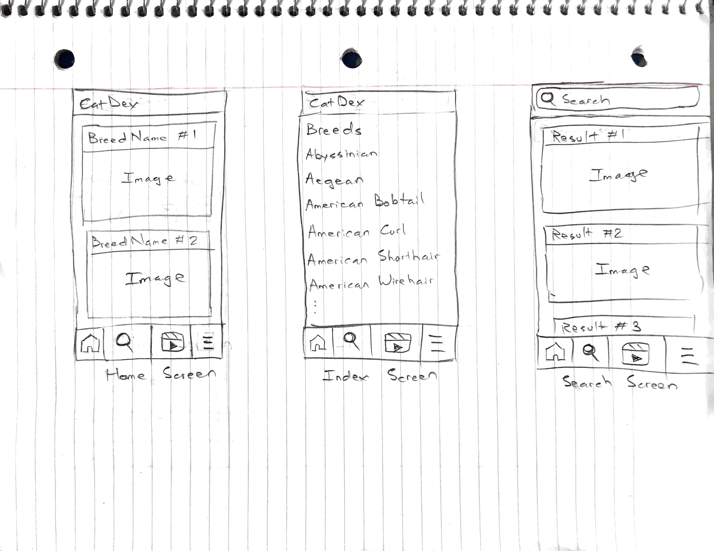
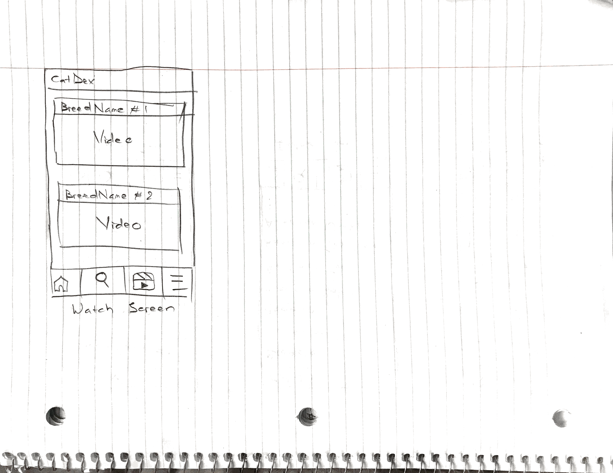

# CodePathGroupProject
Group Project for CodePath Android UCI Winter 2022


Unit 8: Group Milestone
===

# CatDex

## Table of Contents
1. [Overview](#Overview)
1. [Product Spec](#Product-Spec)
1. [Wireframes](#Wireframes)

## Overview
### Description
Allows users to learn more about different breeds of cat through text, images, and a video. 

### App Evaluation
- **Category:** Dictionary
- **Mobile:** This app would be primarily developed for mobile but would perhaps be just as viable on a computer. Functionality wouldn't be limited to mobile devices.
- **Story:** Allows users to search for information about different breeds of cat. The user can decide to view only text or images or video. The user can download images. The user can share the page about a breed of cat to social medias including Facebook, Twitter, Instagram.
- **Market:** Any individual could choose to use this app.
- **Habit:** This app could be used as often or unoften as the user wanted depending on how passionate they are about cats.
- **Scope:** First we would start with making a dictionary about breeds of cat. Then, perhaps this could evolve into a dictionary application about many different types of pet as well to broaden its usage.

## Product Spec
### 1. User Stories (Required and Optional)

**Required Must-have Stories**

* User searches for a specific breed of cat that they want to learn more about and the search bar will display dropdown menu options which they can tap on
* The information page that contains text, images, and a video about a breed of cat is displayed after the user tapping on a choice from the dropdown menu
* Settings (Accesibility, Notification, General, etc.)

**Optional Nice-to-have Stories**

* Log of past information pages that the user visited
* Page of most viewed information pages (i.e. breeds of cat that most users are viewing)
* Optional Shuffle Button (i.e. random information page)

### 2. Screen Archetypes

* Main Screen.
   * Allows user to see pictures of random breeds of cat.
* Search Screens.
   * Displays indices of information pages. Display a search bar for user to quickly search for an index.
* Settings Screen
   * Lets people change language, and app notification settings.

### 3. Navigation

**Tab Navigation** (Tab to Screen)

* Search and Index
* Image Gallery
* Video Gallery
* Text-only View
* Settings

**Flow Navigation** (Screen to Screen)
* Forced Main Screen
* Main Screen -> Search and Index -> Information Page
* Settings -> Toggle settings

## Wireframes




### [BONUS] Digital Wireframes & Mockups

### [BONUS] Interactive Prototype

## Schema 
### Models
#### Breed

   | Property         | Type     | Description |
   | -------------    | -------- | ------------|
   | id               | String   | unique id for each breed |
   | name             | String   | name of the breed |
   | description      | String   | cat description |
   | temperament      | String   | cat temperament |
   | adaptability     | Int      | from 0 to 5 rating the adaptability of the cat breed |
   | affection_level  | Int      | from 0 to 5 rating the affection level of the cat breed |
   | child_friendly   | Int      | from 0 to 5 rating the child friendly of the cat breed |
   | dog_friendly     | Int      | from 0 to 5 rating the dog friendly of the cat breed |
   | energy_level     | Int      | from 0 to 5 rating the energy level of the cat breed |
   | grooming         | Int      | from 0 to 5 rating the grooming level of the cat breed |
   | health_issues    | Int      | from 0 to 5 rating the health issues of the cat breed |
   | intelligence     | Int      | from 0 to 5 rating the intelligence level of the cat breed |
   | life_span        | String   | life span of the cat breed |
   | origin           | String   | what country the breed from|
   | shedding_level   | Int      | from 0 to 5 rating the shedding level of the cat breed |
   | social_needs     | Int      | from 0 to 5 rating the social_needs of the cat breed |
   | stranger_friendly| Int      | from 0 to 5 rating the stranger friendly of the cat breed |
   | vocalisation     | Int      | from 0 to 5 rating the vocalisation of the cat breed |
   | wikipedia_url    | String   | wikipidia url page of the cat breed |

### Networking
#### List of network requests by screen
   - Home Feed Screen and search Feed Screen

      - (Read/GET) Query all the cat breed that contain the key
         ```swift
        val url = "https://api.thecatapi.com/v1/breeds/search?q=$key&api_key=$apikey"
        val client = AsyncHttpClient()
        client.get(url, object: JsonHttpResponseHandler(){
            override fun onFailure(
                statusCode: Int,
                headers: Headers?,
                response: String?,
                throwable: Throwable?
            ) {
                // called when response HTTP status is "4XX" (eg. 401, 403, 404)
                Log.e(TAG, "onFailure $statusCode")
               }

            override fun onSuccess(statusCode: Int, headers: Headers?, json: JSON) { // the ? mark means nullable
                // called when response HTTP status is "200 OK"
            }

        })

        
